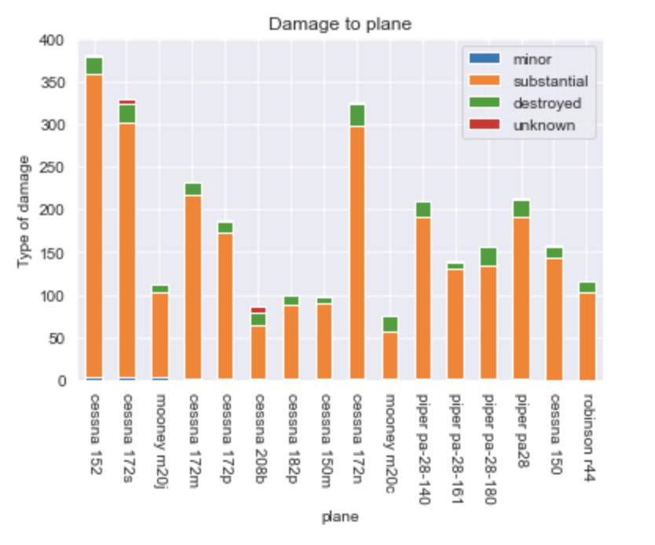
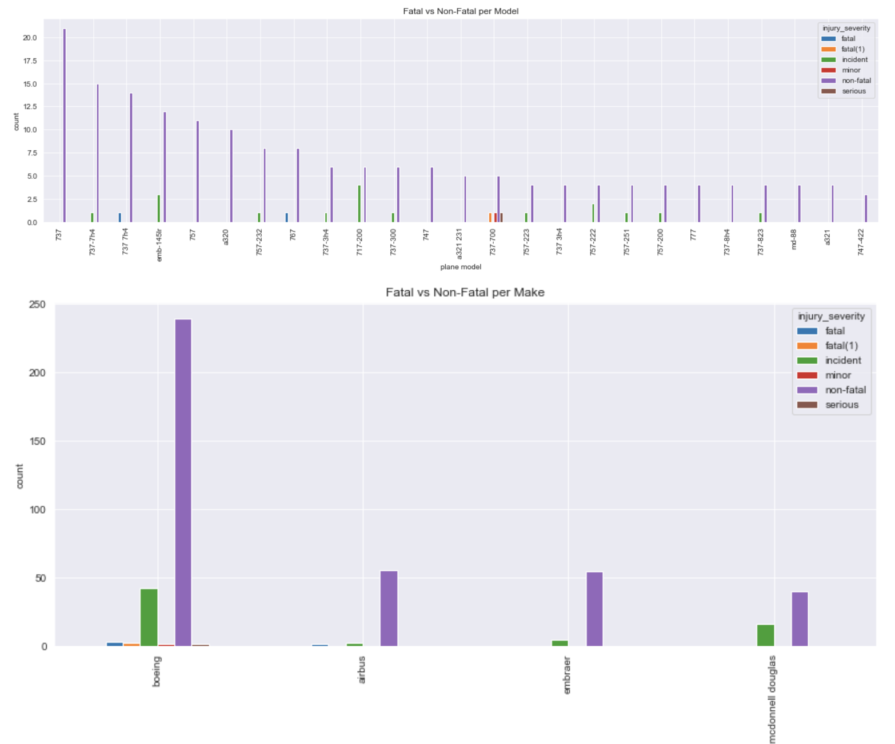
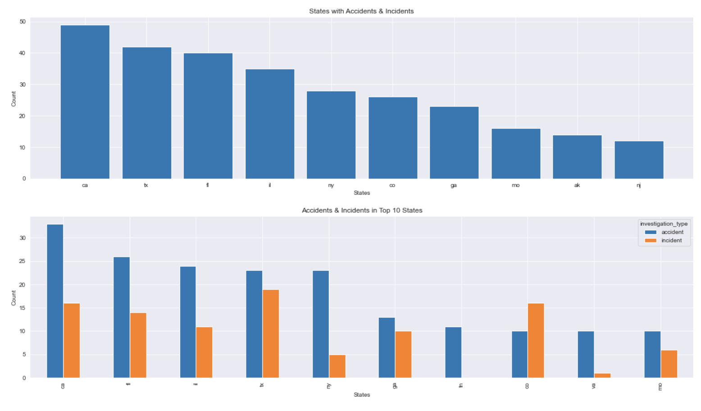

# Flatiron Project 1: Peanut Butter Inc Aviation Risk Data Analysis

### Project Resources
- Project Instructions (Canvas): [[link](https://learning.flatironschool.com/courses/6412/pages/phase-1-project-description?module_item_id=561813#grading)]
- Project Instructions (GitHub): [[link](https://github.com/learn-co-curriculum/dsc-phase-1-project-v3)]
- Aviation Dataset (Kaggle): [[link](https://www.kaggle.com/datasets/khsamaha/aviation-accident-database-synopses)]
- Tableau Dashboard (Tableau): [[link](https://public.tableau.com/app/profile/james.mclaughlin2891/viz/PeanutButterIncRiskAnalysis/Dashboard2?publish=yes)]

### Business Problem
Business Problem
Peanut Butter Inc is expanding in to new industries to diversify its portfolio. Specifically, they are interested in purchasing and operating airplanes for commerical and private enterprises, but do not know anything about the potential risks of aircraft. We will be analyzing the NTSB Aviation Accident data to determine which aircraft are the lowest risk, and the risk associated with operating in our South, West, Midwest, and North East regions for Peanut Butter Inc's new business endeavor.

We will use this analysis to recommend:

- Make and Model of Commercial Airplane based on risk
- Make and Model of Private Aircraft
- Risk associated with region of operation

### Goal
  - Determining which aircrafts are the lowest risk for the company to start this new business endeavor.
  - Translate findings into (3) actionable insights that the head of the new aviation division can use to help decide which aircraft to purchase.

### Data Preparation
Data Cleaning
We dropped 10 columns because they were missing a large amounts of data and/or were not relevant for our analysis.
We chose to Event.Date range to start on 11/19/2001 which was when TSA was established. (https://www.tsa.gov/timeline#:~:text=Jackson%2C%20who%20was%20the%20Deputy,Bush%20on%20November%2019%2C%202001)

### Private Plane Risk Assessment

In this portion of the project we will define private flights as those which carry less than 20 passengers. This number comes from our independent research of the difference between commercial and private flights.(https://www.internationaljet.com/how-many-passengers-can-a-private-jethold.html#:~:text=Similar%20to%20commercial%20planes%2C%20large,flights%20seat%20closer%20to%206)

### Commercial Plane Risk Assessment

#### Fatal Accident Context:
1.) **boeing 777-200er** (2013-07-06):
- Pilot error; upon landing.
- documentation: https://aviation-safety.net/database/record.php?id=20130706-0

2.) **airbus a300 - f4 622r** (2013-08-14):
- Pilot error; failure to properly configure and verify the flight management computer for the profile approach
- documentation: https://aviation-safety.net/database/record.php?id=20130814-0

3.) **boeing 737 7h4** (2018-04-17):
- metal fatigue in the area where the blade broke in the engine.
- documentation: https://aviation-safety.net/database/record.php?id=20180417-0

4.) **boeing 767** (2019-02-23):
- Pilot error; inappropriate response by the first officer as the pilot flying to an inadvertent activation of the go-around mode, which led to his spatial disorientation.
- documentation: https://aviation-safety.net/database/record.php?id=20190223-0

### Operation Location Risk Assessment

- From our analysis we see the majority of fatalities occur in Private planes across all regions. The lowest risk locations for private planes would be the Northeast, followed by the Midwest region.
- There is low risk associated with Commercial aircraft compared to private aircraft when viewing fatalities by region

### Conclusions

- In general, commercial flights are safer than private planes regardless of the commercial manufacturer.

- The only commercial plane we DON’T recommend is the boeing 737 7h4 due to metal fatigue in the engine.

- If company chooses to go private, recommend Cessna 150m or Piper pa-28-161 as safest models.

- Supplementary research showed importance of pilot training: over 80% of crashes occur due to pilot error.

